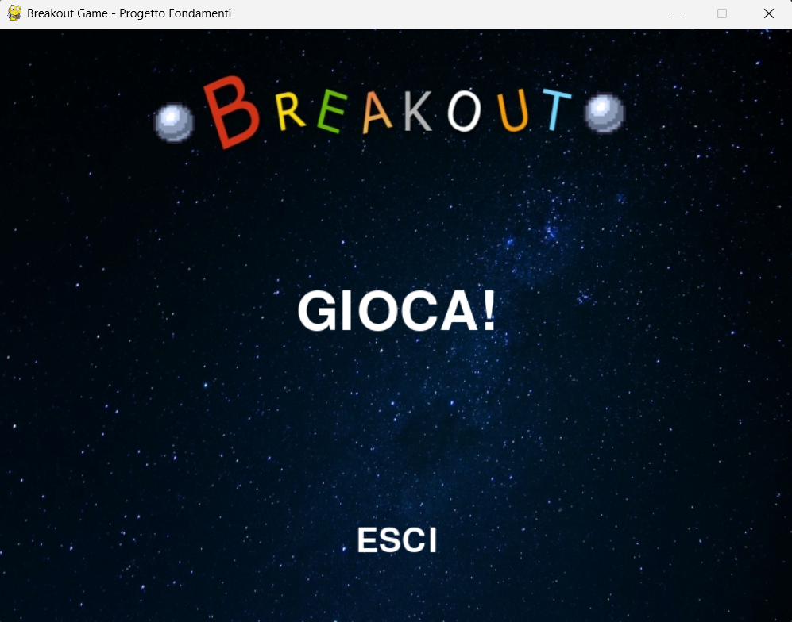
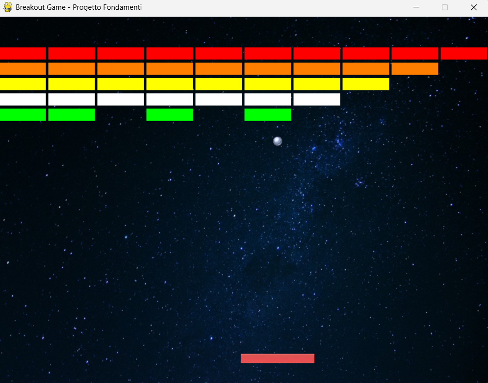

# Breakout Game - Python Arcade 🕹️

Questo progetto è un'implementazione del classico videogioco **Breakout** sviluppata in Python. Il software gestisce un sistema completo di gioco arcade, includendo menu di navigazione, gestione della fisica della pallina e un sistema di punteggio dinamico.

---

## 🎮 Funzionalità Attuali

Il gioco è strutturato in diverse fasi logiche:

### 1. Sistema di Menu e Navigazione
* **Menu Principale**: All'avvio, il giocatore può scegliere tra "GIOCA!" per iniziare la partita o "ESCI" per chiudere l'applicazione.
* **Gestione Input Mouse**: Il menu utilizza il rilevamento delle coordinate del mouse per interagire con i testi a schermo.

### 2. Meccaniche di Gioco (Game Loop)
* **Gestione Paddle**: Movimento fluido della piattaforma tramite le frecce direzionali.
* **Fisica della Pallina**: La palla rimbalza contro i muri, il soffitto e il paddle. Se la palla scende sotto il paddle, il gioco termina.
* **Fisica Avanzata del Rimbalzo**: Il codice calcola 5 zone diverse sul paddle:
    * I bordi danno una spinta laterale maggiore.
    * Il centro fa rimbalzare la palla in verticale.
* **Sistema di Pausa**: Premendo il tasto `P` è possibile sospendere e riprendere la sessione di gioco.

### 3. Struttura dei Blocchi
* Il gioco genera **100 blocchi** disposti in 10 righe.
* Ogni riga ha un colore specifico (Verde, Bianco, Giallo, Arancione, Rosso) gestito dinamicamente tramite liste di `pygame.Rect`.

### 4. Punteggio e Condizioni di Fine Partita
* **Schermata Punteggio**: In caso di sconfitta, viene mostrato il punteggio totale. Il colore del testo cambia in base alla performance (Rosso per punteggi bassi, Verde per i più alti).
* **Vittoria**: Al raggiungimento di 100 punti (distruzione di tutti i blocchi), viene attivata una schermata di vittoria dedicata.

---

## 🛠️ Requisiti Tecnici
* **Linguaggio**: Python 3.x
* **Libreria**: Pygame
* **Asset necessari**: Il codice richiede i file `1.1.png`, `1.jpg` (sfondi), `2.jpg` (paddle) e `3.png` (pallina) nella stessa cartella dello script.

---

## 🕹️ Comandi Rapidi
* **Frecce DX/SX**: Muovi il paddle.
* **Tasto P**: Pausa.
* **Click Mouse**: Navigazione nei menu.

---

  
  

>

## 👤 Autore
**Vittorio Butera**
- GitHub: [@buteravittorio](https://github.com/buteravittorio)
